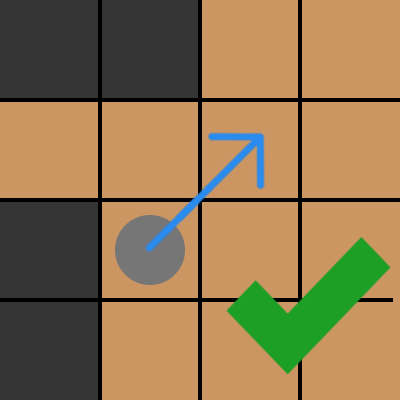
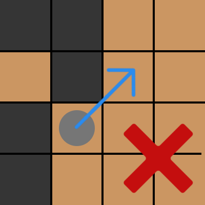
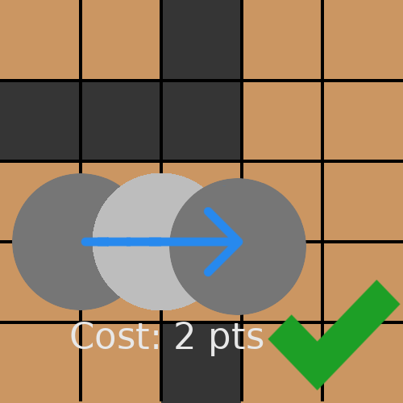
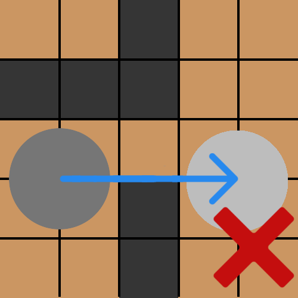
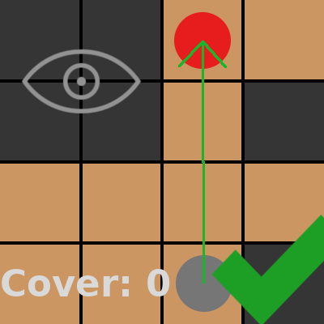
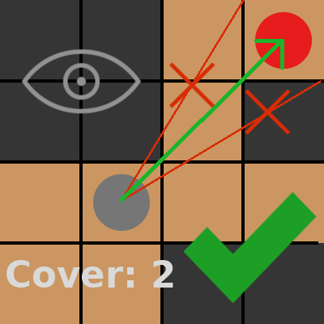
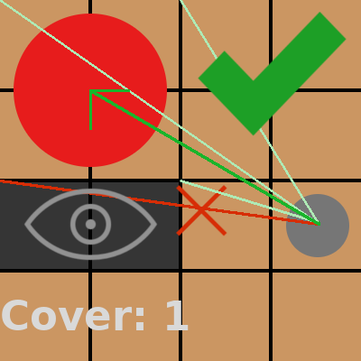
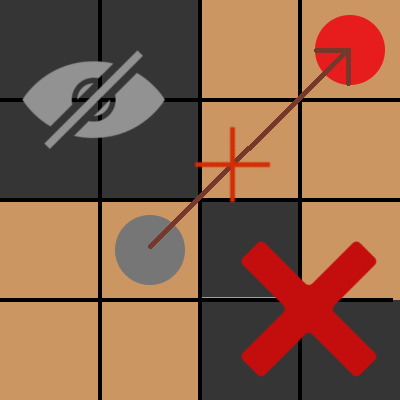

# ONB référence des règles - En cours de création

## Principe du jeu

Plusieurs armées s'affrontent. A chaque tour, les joueurs activent leur unités dans l'ordre, et peuvent agir, se déplacer, effectuer une attaque, utiliser leurs compétences... Leurs statistiques sont pour la plupart cachées: ainsi, pour chaque créature, pour chaque attaque contre chaque adversaire ou chaque actions, le dé a lancer, le bonus au dé et au dégâts, et la difficulté ou la table de dégâts a regarder sont pré-calculées.

Le jeu dois ainsi avoir des règles simple a utiliser, mais potentiellement large en arrière-plan, tant que cela n'affecte pas l'expérience des joueurs

*Ici, les termes unité, et créature, sont équivalent et désigne n'importe quelle entitée représentée par une figurine, y compris un humain ou une machine*

________________________________

## Tour de jeu

### Initiative et activation

Chaque créature possède une valeur d'initiative (**INIT**). En cas de conflit entre plusieurs unités ayant la même **INIT**, on décide au dé. Les unités du même type et appartement au même joueur sont ici considérées en groupe, elles pourront agire dans n'importe quel ordre

A chaque tour (**round**) vient la phase d'activation. Dans l'ordre de l'initiative la plus haute a la plus faible, les joueurs choisissent, soit d'activer la créature, soit d'attendre (dans ce cas, on peut poser un marque *"Attente"* sur sa carte). Si un même joueur ou des joueurs alliés ont plusieurs créature avec la même initiative, ils peuvent choisir l'ordre dans lequel les activer comme bon leur semble. Si la créature a été activée, elle effectue ses actions (voir section "activer une créature").

Une fois que toutes les créatures ont joué ou passé, on remonte l'ordre du tour, dans le sens inverse, de la créature a l'**INIT** la plus haute a celle la plus basse. Les créatures n'ayant pas été activées  ce tour ci le sont alors automatiquement (le joueur **doit** les activer, mais peu ne rien faire durant leur tour). Ainsi, la créature a l'**INIT** la plus élevée peut décider de joueur au début ou a la fin du round.

### Activer une unité

#### Actions du tour de jeu

Lorsqu'une unité est activée, elle peut, au choix:

- Ne rien faire, et passer directement a la fin de sa phase d'activation
- Effectuer une action longue
- Effectuer une OU deux demi-actions (actions courtes)

Une action longue prend tout le round de la créature: par exemple, un déplacement sur une distance longue (sprint). Une demi-action correspond a une action brêve. De plus, sauf pouvoir indiquant le contraire, une créature ne peux effectuer qu'une seule action de mouvement par tour, ainsi qu'une seule attaque. Pour avoir des détails sur les actions, voir plus bas.

#### Fin de l'activation de la créature

A la fin de se phase d'activation, une créature **doit** retirer tout les marqueurs temporaires qui doivent l'être. Pour la plupart d'entre elles, le joueur peut également gratuitement orienter la figurine dans n'importe laquelle des **8 directions**, c'est a dire vers chacun des quatre cotés, ou en diagonale.

________________________________

## Actions

### Déplacements

Chaque créature dispose de deux valeurs de déplacements: la valeur de course, et celle de sprint. Elle a ainsi le choix, si elle décide de se déplacer, entre se déplacer **une seule fois** du nombre de case de sa valeur de course, en une demi-action, ou se déplacer en sprint, ce qui lui prend son tour complet. Si elle effectue une action de course, elle pourra effectuer une autre action simple, attaquer par exemple, mais **pas** d'autre déplacement.

Passer d'une case a une case adjacente par un **coté** coûte 1 point de mouvement. Se déplacer en diagonale coûte 1/2 point supplémentaire. **Entrer** sur certaines cases a un coût supplémentaire, mais généralement, *pas en sortir*. Ainsi 
 sur une case encombrée coûte un point  de pluse, dans une case d'escalier, 1/2 point en plus. *Par exemple, se déplacer vers une case encombrée par un coté coûte 2, vers une case d'escalier par une diagonale coûte 2, vers une case encombrée en diagonale coûte 2,5.*

 On ne peut se déplacer en diagonale que si les deux cases entre la case de départ et d'arrivée sont libres. On ne peut passer que sur des cases libres, sans traverser de murs ou de portes fermées, ni d'obstacles. Il est possible de passer a travers des cases occupées par des alliés ou des créatures neutres non-hostiles, mais pas de s'y arrêter, et il est impossible de traverser une case occupée par un ennemi.
 
  
 
Les créature ayant un socle de grand taille (plus de une case) se déplacent d'une case a la fois, et ne peuvent pas passer par les passages trop étroits pour leur socle.

 

#### Charge

Si la créature ne se trouve pas au contact avec un ennemi et qu'elle a une ligne de vue sur sa cible, elle peut effectuer une charge. Elle se déplace alors du nombre de cases de sa valeur de sprint, et effectue une attaque de contact contre celle-ci (ce doit être une **demi-action d'attaque de corps-a-corps**, rendue gratuite par la charge). 

On doit pouvoir tracer une ligne droite entre le centre de l'unité et sa cible, sans qu'elle rencontre d'obstacle ou de créatures. La créature doit se mouvoir selon les même règles, sans passer au travers d'obstacle ni de créatures, alliées ou ennemies.

#### Attaques d'opportunité

**TODO** -> éviter ? coût ? bonus/malus ?

### Combat

Être au contact signifie être au corps a corps avec une créature **enemie**, c'est à dire avoir un contact par un coté ou une diagonale d'une case avec celle-ci. Ainsi, la **zone d'influence** d'une unité sont les 8 cases adjacentes a celle-ci.

#### Ligne de vue

Une créature (créature **ciblant**, ou **active**) a une ligne de vue vers une autre (**cible**) si on peut tracer une ligne droite allant du centre de cette créature au centre de sa cible, et qui ne traverse aucun. Cette ligne peut passer par un coin de mur si les cases a coté sont libres.

Tout objet dont la case est coupée par cette ligne est considéré comme obstacle a la ligne de vue (uniquement si la ligne passe **dans** la case, pas sur le coin). En fonction de la taille de ces obstacles, ils peuvent augmenter la couverture, ou couper la ligne de vue (dans ce cas, il n'y en a pas). Plus exactement:

- Tout obstacle plus petit que l'active et la cible **ne gênent pas**
- Toutes les autres créatures ennemies, et tous les alliés ou obstacles plus grand que les deux créatures
 **coupent la ligne de vue**
- **+2 de couverture** pour tout autre obstacle ou allié sur la ligne de vue

COUVERTURE (COVER):
La couverture (**Cover**) est un malus qui va s'appliquer sur tout les jets de dés prenant en compte cette ligne de vue: par exemple, une attaque a distance. Si la créature ciblée n'est pas entièrement visible, elle bénéficie d'un point de couverture supplémentaire pour chaque coin de sa base qui n'est pas visible.

##### Exemples

   

##### Cas spécial 1: cibler une case

Dans ce cas, on cible la case de la même manière que si on visait une créature dessus. Seuls sont gênants les obstacles de taille supérieure ou égale a la créature ciblant. et les mêmes règles s'appliquent.

##### Cas spécial 2: attaque balistique

Dans ce cas, les créatures se trouvant entre l'unité attaquante et la cible ne donnent aucun couvert.De plus l'unité de balistique a un bonus de hauteur (éventuellement +0): seules les unités (alliés ou ennemis) et obstacles **strictement plus grands** que l'unité ciblée **plus** le bonus de hauteur coupent la ligne de vue. Sinon, elles ne fournissent aucune couverture.
*Par exemple, quelle que soit sa taille, une unité de tir balistique avec un bonus +2  peut tirer sur une unité de taille 3 si aucune créature de taille plus que 5 (3+2) ne se trouve entre deux. Les unités de taille 6 ou 7 couperaient la vue, alors que celles de taille 5, 4 ou moins n'on aucun effet).

##### Cas spécial 3: attaque non-physique

Dans ce cas, on vérifie s'il y a une ligne de vue, mais aucun malus de couverture ne s'appliquera. 
*Note: une boule de feu, même magique, est une attaque physique non-balistique et n'est pas concernée par cette règles. Les attaques psychiques ne sont pas physique et sont donc concernées*

________________________________

## Créatures

________________________________

## Matériel

### Général

- Plateau de jeu utilisé: case carrées, a six cotés
- Des figurines
- Des dés, au moins un de chaque, de ces types: 4, 6, 8, 10, 12, 20

### Spécifique au jeu

- Marqueurs (petits jetons servant a marquer les dégâts, les effets, la mana...)

### Créatures

- Un marqueur d'initiative, au nom de la créature, pour faire une liste d'ordre de tour. S'il y a plusieurs unité d'un même type, on en utilise un seul

## Termes, mesures

- Un round représente quelque secondes
- Point de vie d'un humain moyen: 5PV

TODO:
- valeur absolue d'un point de dé
- Tailles

## A ajouter
- Tables
- Stats cachées
- Réussite a 10